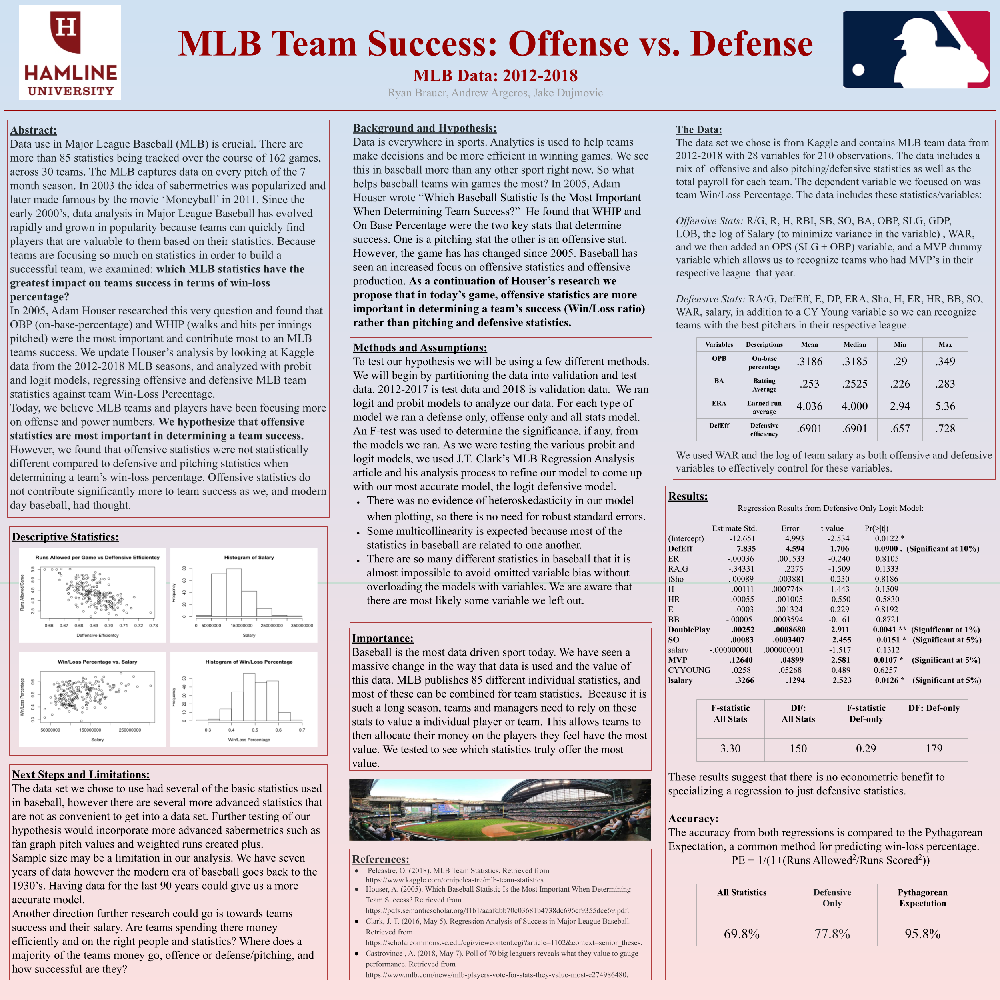

# Federal Reserve 2020 MLB Team Success
##### Coauthors: Ryan Brauer and Jake Dujmovic

## Synopsis

This project attempted to study the effects of statistics both offensive and defensive (pitching included) on MLB teams' win loss percentages. We used season-level data from the 2012-2018 MLB regular seasons, passed in probability adjusted logistic regressions as estimators. We then calculated accuracy as 1 - the mean absolute percent error (MAPE).

The poster and analysis finished first in the 2020 Federal Reserve - Minnesota Economic Association Conference for Economic Communication.
